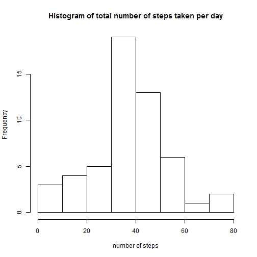
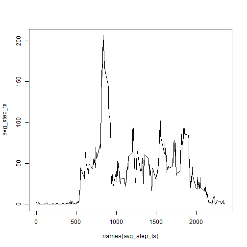
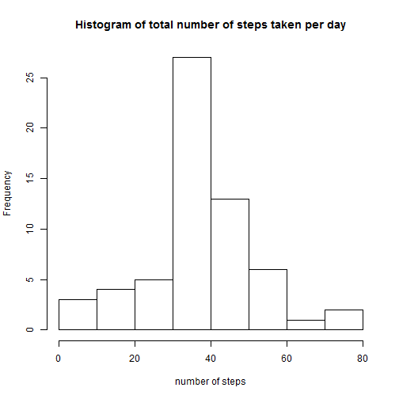

Activity monitoring data analysis
========================================================

### Loading and preprocessing the data


```r
df <- read.csv("activity.csv", stringsAsFactors=FALSE)
df$date <- as.Date(df$date, "%Y-%m-%d")
df$steps <- as.numeric(df$steps)
```

### Histogram of the total number of steps taken each day

```r
steps_per_day <- sapply(split(df$steps, df$date), function(x) mean(x, na.rm=TRUE))
hist(steps_per_day, main="Histogram of total number of steps taken per day", xlab="number of steps")
```

 

The mean and median total number of steps taken per day are:

```r
mean(steps_per_day, na.rm=TRUE)
```

```
## [1] 37.38
```
and

```r
median(steps_per_day, na.rm=TRUE)
```

```
## [1] 37.38
```

### Average daily activity pattern analysis
Time series plot of 5-minite interval(x-axis) and the average number of steps taken, average across all days (y-axis):

```r
avg_step_ts <- sapply(split(df$steps, df$interval), function(x)mean(x, na.rm=TRUE))
plot(avg_step_ts~ names(avg_step_ts), type="l")
```

 

5-minute interval with max number of steps is

```r
names(avg_step_ts)[which.max(avg_step_ts)]
```

```
## [1] "835"
```

### Imputing missing values

Total number of missing values:

```r
sum(is.na(df$steps))
```

```
## [1] 2304
```

Impute missing values with the mean of 5-minute interval:

```r
fill_na <- function(i, df, fill_value){
	      step <- df[i, 1]
	      interval <- as.character(df[i, 3])
        if (is.na(step)){
                new_step <- fill_value[interval]
        } else {
                new_step <- step
        }
	      new_step
}
df_new <- df
df_new$steps <- mapply(fill_na, i = 1:nrow(df), MoreArgs = list(df, avg_step_ts))
sum(is.na(df_new$steps))
```

```
## [1] 0
```

Updated histogram of the total number of steps taken each day:

```r
steps_per_day_new <- sapply(split(df_new$steps, df_new$date), function(x) mean(x))
hist(steps_per_day_new, main="Histogram of total number of steps taken per day", xlab="number of steps")
```

 

The mean and median total number of steps taken per day for updated data are:

```r
mean(steps_per_day_new)
```

```
## [1] 37.38
```
and

```r
median(steps_per_day_new)
```

```
## [1] 37.38
```
The mean and median do not change by imputing missing data.

### Activity patterns comparison between weekdays and weekends
Generate a variable to indicate whether a given date is a weekday or weekend:

```r
weekday <- weekdays(df_new$date)
df_new['weekday'] <- sapply(weekday, function(x) y <- if(x %in% c("Saturday","Sunday")){"Weekend"}else{"Weekday"})
df_new$weekday <- as.factor(df_new$weekday)
levels(df_new$weekday)
```

```
## [1] "Weekday" "Weekend"
```

Time series plot of the 5-minute interval and the average number of steps taken, averaged across all weekday days or weekend days:

```r
library(lattice)
library(reshape2)
```

```
## Warning: package 'reshape2' was built under R version 3.1.1
```

```r
dfs <- split(df_new, df_new$weekday)
plots <- data.frame(sapply(dfs, function(df) sapply(split(df$steps, df$interval), function(x)mean(x, na.rm=TRUE))))
plots["interval"] = as.integer(row.names(plots))
plots <- melt(plots, id=3, measure=c("Weekday","Weekend"))
xyplot(value~interval|variable, data=plots, layout=c(1,2), type="l", ylab="Number of steps", xlab="Interval")
```

 
